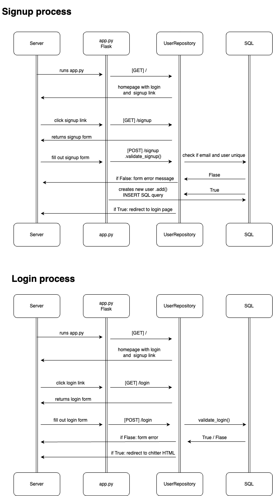

# Chitter App

Chitter is a web application that allows users to post messages (peeps) and view them in reverse chronological order. Users can sign up, log in, and log out to manage their interactions on the platform.

## App Structure

The main application logic is contained in `app.py`, utilizing the Flask web framework. The app has various routes to handle HTTP requests and render corresponding HTML templates. The application interacts with a PostgreSQL database for data storage and retrieval.

## API Endpoints

- `GET /`: Home page.
- `GET /signup`: Sign-up page.
- `POST /signup`: Sign-up submission.
- `GET /login`: Login page.
- `POST /login`: Login submission.
- `GET /home`: Access the homepage and view peeps.
- `POST /post`: Submit a new peep.
- `GET /logout`: Log out.

## Database Structure

The application uses a PostgreSQL database with the following tables:

- `users`: Contains user information (id, email, username, name, password).
- `peeps`: Stores peep data (id, content, user_id, date_time).

## Testing

Testing is done using Pytest and Playwright for end-to-end testing. To run the tests, use the following command:

```bash
pytest
```

This will run all the tests and display the results.

## What I Learned

In the development of this app, I gained experience in several technologies and concepts, including:
- Python programming
- PostgreSQL database
- Writing HTTP requests and handling HTTP responses
- Working with Flask for web development
- Unit testing with Pytest
- End-to-end testing with Playwright
- HTML for web page design

## Further Development

The Chitter app has undergone significant improvements to enhance its functionality and security. These improvements include:

- Passwords are now hidden in input forms for increased security.
- Password hashing has been implemented to protect user passwords.
- The user interface has been updated for a more user-friendly experience.
- HTTP sessions have been added for better user session management.

Additionally, future improvements and features to be considered for the Chitter app include:

- Implementing a more polished and user-friendly user interface using CSS for enhanced UX.
- Adding email notifications for mentions in peeps.
- Strengthening the password validation during sign-up.
- Enhancing security by encrypting the database passwords.

## Workflow

### User stories

- As a User, I want to post a message (peep) to Chitter so that I can let people know what I am doing.
- As a User, I want to see all peeps in reverse chronological order so that I can see what others are saying.
- As a User, I want to see the time at which a peep was made to better appreciate its context.
- As a User, I want to sign up for Chitter so that I can post messages on Chitter as me.
- As a User, I want to log in to Chitter so that only I can post messages on Chitter as me.
- As a User, I want to log out of Chitter so that I can avoid others posting messages on Chitter as me.

### Diagram


## Usage

1. Clone the repository:
   ```
   git clone <repository_url>
   cd chitter-app
   ```

2. Set Up a Virtual Environment (Optional but Recommended):
   ```bash
   python -m venv venv
   source venv/bin/activate  # On Windows, use: venv\Scripts\activate
   ```

3. Install Dependencies:
   ```bash
   pip install -r requirements.txt
   ```

4. Run the App:
   ```bash
   python app.py
   ```

   The app will be accessible at `http://localhost:5001` by default.

5. Run the Tests:
   ```bash
   pytest
   ```

   This will run all the tests in the project and display the results.

6. Run Specific Test(s):
   ```bash
   pytest <path_to_test_file_or_directory>
   ```
